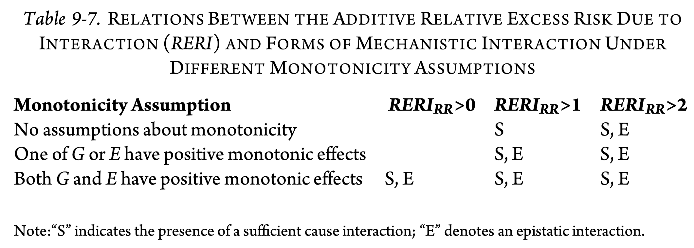

# Causal interactions

Suppose the outcome $Y$ is binary with two binary treatments $G$ and $E$ which are also binary. Let $p_{ge}=P(Y=1|G=g, E=e)$ be the probability of the outcome when $G=g$ and $E=e$. The causal interaction is assessed by the extent to which the effect of the two factors together exceeds the effect of each considered individually, that is
$$
\begin{aligned}
&\left(p_{11} - p_{00}\right) - \left[\left(p_{10} - p_{00}\right) + \left(p_{01} - p_{00}\right)\right] \\
=\:&p_{11} - p_{10} - p_{01} + p_{00}
\end{aligned}
$$
which is called the *additive* interaction. In addition, risk ratios $RR$ and odds ratio $OR$ are called *multiplicative* interaction, defined as $RR=\frac{RR_{11}}{RR_{10}RR_{01}},\:OR=\frac{OR_{11}}{OR_{10}OR_{01}}$ where $RR_{ij}=p_{ij}/p_{00}$, $OR_{ij}=\frac{p_{ij}/(1-p_{ij})}{p_{00}/(1-p_{00})}$.

In addition, the **relative excess risk due to interaction** or **RERI** is defined as
$$
\begin{aligned}
RERI_{RR}&=\frac{1}{p_{00}}\left(p_{11} - p_{10} - p_{01} + p_{00}\right)\\
&=RR_{11}-RR_{10}-RR_{01}+1
\end{aligned}
$$
Consequently, if the outcome is rare, then
$$
\begin{aligned}
RERI_{RR}&\approx RERI_{OR}\\
&=OR_{11}-OR_{10}-OR_{01}+1
\end{aligned}
$$

## Simple Causal Interaction

Simple causal interaction is the most straightforward type of interaction.

1. Has no restrictions on the values of $Y_{11},Y_{10},Y_{01},Y_{00}$.
2. Use the sign of RERI to assess the **direction** of the additive interaction.

## Sufficient Cause Interaction

Assumption of **positive monotonicity (PM)**: the effect of both treatments never be preventive for the outcome for any person in the population. In other words, the effects of both exposures on the outcome be monotonic. For example, smoking is not protective for lung cancer.

The first mechanistic interaction is sufficient cause interaction.

1. $Y_{11}=1,Y_{10}=Y_{01}=0$ but no requirement for $Y_{00}$.
2. **If PM does not hold**: $p_{11} - p_{10} - p_{01} > 0$ OR $RERI_{RR} > 1$ implies sufficient cause interaction.
3. **If PM holds**: $p_{11} - p_{10} - p_{01} + p_{00} > 0$ OR $RERI_{RR} > 0$ implies sufficient cause interaction.

## Epistatic/Singular Interaction

The second mechanistic interaction is the epistatic or singular interaction. It is even an stronger notation comparing to sufficient cause interaction.

1. $Y_{11}=1,Y_{10}=Y_{01}=Y_{00}=0$
2. **If PM does not hold**: $p_{11} - p_{10} - p_{01} - p_{00} > 0$ OR $RERI_{RR} > 2$ implies epistatic interaction.
3. **If PM holds**
    a. **If only one treatment has PM effects**:  $p_{11} - p_{10} - p_{01} > 0$ OR $RERI_{RR} > 1$ implies epistatic interaction.
    b. **If both treatments has PM effects**: $p_{11} - p_{10} - p_{01} + p_{00} > 0$ OR $RERI_{RR} > 0$ implies epistatic interaction.
    
{ width=80% }

## Assessing RERI by statistical interaction

In practice, interactions between two variables are evaluated using statistical models by including a product term between them. Similarly, both additive and multiplicative interactions can be estimated using generalized linear models (GLMs) by selecting an appropriate canonical link function $g$. Controlling for covariates $\boldsymbol{C}$, the GLM is expressed as:
$$
g(P(Y=1 | G=g, E=e, \boldsymbol{C}=\boldsymbol{c}))=\eta=\beta_0+\beta_1 g+\beta_2 e+\beta_3 ge+ \boldsymbol{\beta_4}\boldsymbol{c}
$$
The interpretation of coefficients depends on the canonical link $g$:

1. If we take $g$ as the identity link, then $\beta_0=p_{00}, \beta_1=p_{10}-p_{00}, \beta_2=p_{01}-p_{00}$, and $\beta_3=p_{11}-p_{10}-p_{01}+p_{00}$.
2. If we take $g$ as the log link, then $e^{\beta_0}=p_{00}, e^{\beta_1}=R R_{10}, e^{\beta_2}=R R_{01}$, and $e^{\beta_3}=$ $R R_{11} /\left(R R_{10} R R_{01}\right)$. $\beta_1$ and $\beta_2$ are so-called the main effects and exponentiated $\beta_3$ gives the measure of multiplicative interaction.
3. If we take $g$ as the logit link, then $e^{\beta_0}=p_{00},\:e^{\beta_1}=OR_{10},\: e^{\beta_2}=OR_{01},\:e^{\beta_3}=OR_{11} /\left(OR_{10} OR_{01}\right)$.

# Current work

VanderWeele, T. J., & Vansteelandt, S. (2011). A weighting approach to causal effects and additive interaction in case-control studies: marginal structural linear odds models. American journal of epidemiology, 174(10), 1197–1203. https://doi.org/10.1093/aje/kwr334

The simulation study is based on the case-control study of lung cancer. It follows as:

1. Using the given sample size, generate the binary gender and educational history using the empirical multi-nomial distribution. Also generate the age following normal distribution with respect to each gender-education stratum.
2. Generate the two binary exposures: smoking status and genotype using logistic regressions, conditional on the covariates.
3. Generate the binary outcome, lung cancer status, using logistic regression which includes the main effects and interaction of the two exposures, as well as the main effects of the three covariates. The resulting data contains 1836 cases and 1452 controls.
4. Analyze the data using the proposed methods.
5. Repeat steps 1 to 4 for 1000 times.

# Potential extensions

Potential extensions:

1. Multi-level treatments: both $G$ and $E$ have three levels or one has three levels and another still has two levels.
2. Three or more exposures
3. One treatment is continuous and another is still binary.
4. Marginal Structural Models

Tentative title: **Marginal Structural Models for Sufficient Cause Interactions for Ordinal Exposures with Three Levels**